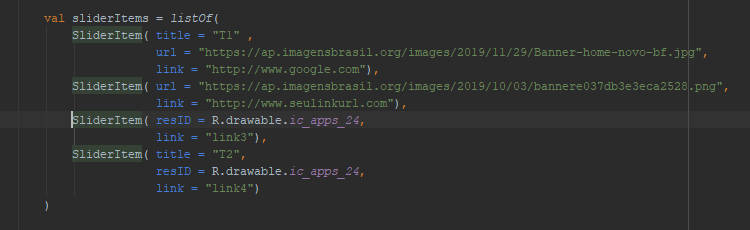

# Slider Image Referral Points
ViewPager of images with position reference points

# Installation

    allprojects {
      repositories {
        google()
        jcenter()
        ...
        maven { url 'https://jitpack.io' }
      }
    }

Build.gradle

    dependencies {
      implementation 'com.github.fill93:sliderimage_referral_points:1.0.3'
    }
    

    
# Usage

Add the XML tag as shown in the image

Instantiate your list of **SliderItem** objects and add your Items

Use **setPages** passing your list

   

Use **handleAnimate** by passing the time in milliseconds to animate your slide

    

To capture user input on your slide, implement the **CallOnClickSlider** interface and its method **(onClickSlider)**

    
# Result

